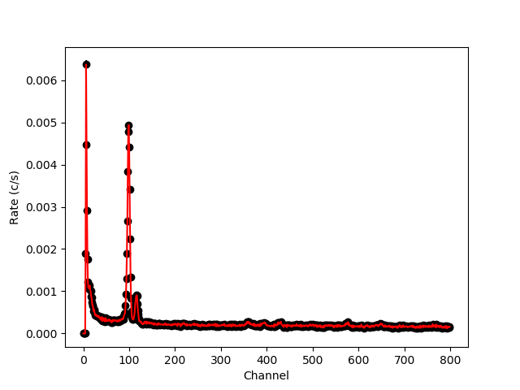
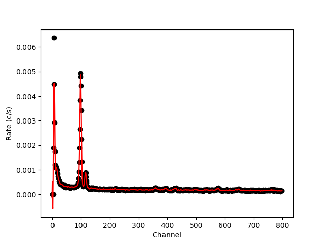

.. _bkgsmooth:

Bkgsmooth - Smooth background spectra
=====================================

.. highlight:: none

Using C-statistics on background subtracted spectra can be very tricky. Given how
C-statistics is defined, the algorithm expects a best estimate for the background
spectrum. Usually, a measured background is subtracted, including noise, which could
bias your result. Actually, the best input for C-statistics would be a model of the
background spectrum. Unfortunately, these are not always available.

Since many instruments have rather smooth background spectral shapes (with some
spectral lines), it is many times possible to reduce the noise in a measured
background spectrum by smoothing it. This is the purpose of the ``bkgsmooth`` tool.

Usage
-----

``bkgsmooth`` is a small interactive tool with a command prompt. This allows
the user to explore different filter parameters. The tool is started just by
typing ``bkgsmooth`` on the command line::

    linux:~> bkgsmooth
    ==================================
     This is bkgsmooth version 0.4.0
    ==================================
    (C) 2018-2020 Jelle de Plaa
    SRON Netherlands Institute for Space Research
    Github: https://github.com/spex-xray/pyspextools

    BKGSMOOTH>

The tool reads a PHA type background spectrum and returns a PHA with a smoothed
background rate. The resulting PHA file can then be used in ``ogip2spex``,
for example, to be used as background to be subtracted.

The first step is to read a background PHA file::

    BKGSMOOTH> read MOS1_back.pha

The ``bkgsmooth`` tool now opens a plot window with the background spectrum and a
line connecting the data points.

Many times, the low- or high end of the spectrum contains non-usable data because
of instrument effects and/or calibration difficulties. To select the good parts
of the spectrum, one can use the ``select`` function to set the channel range to
smooth::

    BKGSMOOTH> select 11 799
    Next time, the spectrum is filtered between channel 11 and 799.
    Outside the interval, the original background is assumed.

This way, the bad regions are not touched and do not interfere with the renormalization
of the spectrum done after filtering.

``bkgsmooth`` contains a couple of filters to apply to the background spectrum.
Currently, one can only apply one filter at the time. Each time, the filter is
applied to the original spectrum. In this example, we apply the `Savitzky-Golay
<https://docs.scipy.org/doc/scipy/reference/generated/scipy.signal.savgol_filter.html>`_
filter to the spectrum. For this filter, the window length (first integer) needs
to be odd and positive. The second integer needs to be smaller than the window length::

    BKGSMOOTH> savgol 11 5

The red line in the plot is now showing the smoothed filter result. You can adjust
the parameters of the ``savgol`` function until you are satisfied with the result.
The goal would be to reduce the noise substantially without creating too large
artifacts due to the filter.

As one can see, at the low energy side, the filtered spectrum shows quite a
large artifact due to a large jump in the spectrum. Since this occurs below
the energy band that we consider well calibrated, this is not a problem.

Once the filter output is good, the spectrum can be saved::

    BKGSMOOTH> write MOS1_back_smoothed.pha

This command saves the spectrum to the file ``MOS1_back_smoothed.pha``. If
this is all, we can quit::

    BKGSMOOTH> quit

The file ``MOS1_back_smoothed.pha`` can now be used in the :ref:`ogip2spex`
command as a background spectrum to create a ``spo`` and ``res`` file.

Filters
-------

Currently, ``bkgsmooth`` contains two filter types: a Savitzky-Golay and a
Wiener filter.

Savitzky-Golay filter
'''''''''''''''''''''

A `Savitzky-Golay filter <https://en.wikipedia.org/wiki/Savitzky%E2%80%93Golay_filter>`_
is designed to smooth a dataset without increasing the width of lines. Therefore, it is
a very useful filter if there are spectral lines in the background spectrum. The filter
fits a low-degree polynomial within a pre-set window length. The window length (odd number
of datapoints to fit at a time) and the order of the used polynomial can be set to modify
the filter behaviour.

In ``bkgsmooth``, the filter is applied as follows::

    BKGSMOOTH> savgol <window_length> <polyorder>

Where ``<window_length>`` is the window length and ``<polyorder>`` the polynomial order.
The window length should strictly be an odd positive integer and the polynomial order
should be an integer less than the window length.

.. Warning:: The Savitzky-Golay filter does not conserve flux. If the smoothed curve
   follows the original data well, then the flux difference will usually be within
   the original uncertainties. Please check the flux of your smoothed spectrum if
   you are unsure or if you need high flux accuracy.

Wiener filter
'''''''''''''

A `Wiener filter <https://en.wikipedia.org/wiki/Wiener_filter>`_ is a commonly used filter
to reduce noise in a data set. To modify the behaviour of the filter, one can specify the
Wiener filter window length. In the ``bkgsmooth`` tool, this is done as follows::

    BKGSMOOTH> wiener <window_length>

Where ``<window_length>`` is a positive integer.

.. warning:: The Wiener filter tends to smooth out spectral lines as well. If there are
   spectral lines in your spectrum, please use the Savitzky-Golay filter.

Gaussian filter
'''''''''''''''

A Gaussian filter is just a convolution with a normal distribution with a given standard
deviation. Gaussian convolution is a very common algorithm to smooth noisy datasets.
The Gaussian filter is called with a standard deviation like this::

    BKGSMOOTH> gauss <stddev>

Where ``<stddev>`` is a positive floating point number.

.. warning:: The Gaussian filter tends to smooth out spectral lines as well. If there are
   spectral lines in your spectrum, please use the Savitzky-Golay filter.
